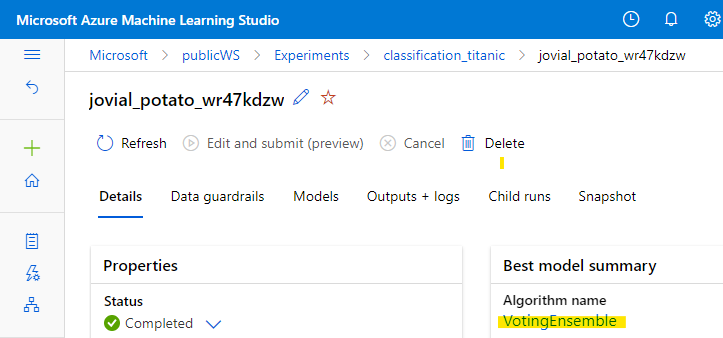
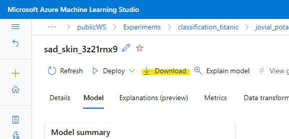
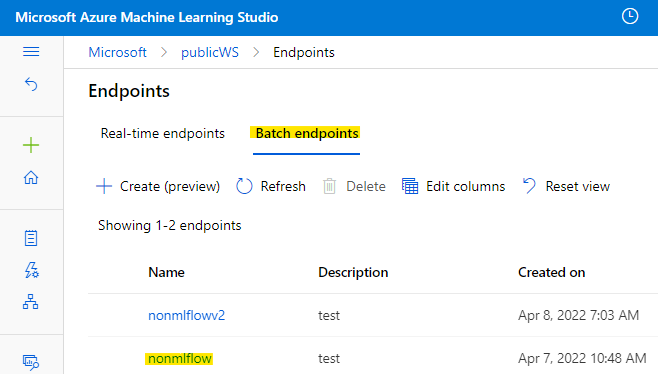
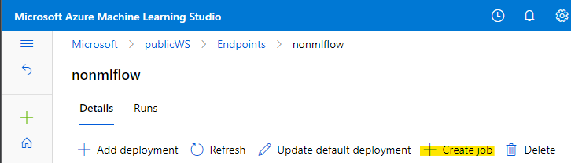
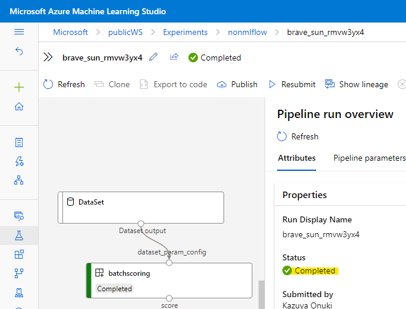
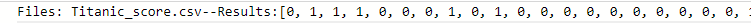

# azureml-batch-endpoint-titanic-example
This repository is the batch-endpoint example by titanic-dataset.

# Prerequisites
- `Azure CLI ml extension (v2)`
    - if you already install `azure-cli-ml (v1)`, follow these steps
        - do `az extension remove -n azure-cli-ml`
        - and execute `az extension add -n ml -y`

# Implementation Step
1. execute `train-automl.ipynb` to train using `{your-root-dir}/data/Titanic_train.csv`
1. Once training is complete, go to the appropriate RUN and download the optimal model object file(`.pkl`) locally.
    - select "Best model summary"(eg. `VotingEnsemble`)
    
    
    - click "Download" to get `model.pkl` and save this pkl file in`{your-root-dir}/model`.
    
1. execute `get-training-automl-env.ipynb` to get the same env(`.yml`) as the model-training and save yaml file in `{your-root-dir}/env`.
1. register AML Dataset as `titanic_test` using `{your-root-dir}/data/Titanic_score.csv`
    - ! NOTE: __Never create a data set in TabularDataset, not in FileDataset. This is because TabularDataset is not currently supported by batch endpoints.__ 
1. create scoring-file(`score.py`) and save this file in `{your-root-dir}/code`.
1. create model to your AML workspace with `model.yml`
    - execute `az ml model create --subscription <Your Subscription Id> --resource-group <Resource Group> --workspace-name <Workspace> --file ./model.yml` on CMD.
1. create Batch-Endpoint with `endpoint.yml`
    - execute `az ml batch-endpoint create --subscription <Your Subscription Id> --resource-group <Resource Group> --workspace-name <Workspace> --file ./endpoint.yml` on CMD.
1. deploy with `deploy.yml`
    - execute `az ml batch-deployment create --subscription <Your Subscription Id> --resource-group <Resource Group> --workspace-name <Workspace> --file ./deploy.yml` on CMD.
1. call deployed batch endpoints on the Studio UI.
    - click `[Endpoints]->[Batch endpoints]->[<your endpoint(eg.nonmlflow)>]` on Studio UI.
    
    - select `[+ Create job]` and predict.
    
    - Then follow the steps on the screen to confirm that inferences can be made.
    // Successes Example
    
    // Predicted Values Example
    

# Reference
- [Install and set up the CLI (v2)](https://docs.microsoft.com/en-us/azure/machine-learning/how-to-configure-cli?tabs=public)
- [Use batch endpoints (preview) for batch scoring](https://docs.microsoft.com/en-us/azure/machine-learning/how-to-use-batch-endpoint)
